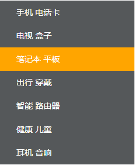

# HTML学习笔记 Part04-CSS层叠样式表 二

## 目录
1. Emmet语法
2. CSS的复合选择器
3. CSS的元素显示模式
4. CSS的背景
5. CSS的三大特性
6. CSS的注释

<!--more-->

## 1. Emmet语法
Emmet语法的前身是Zen coding，它使用缩写来提高html/css的编写速度，VSCode内部已经集成了该语法。

### 1.1 快速生成HTML结构语法
1. 生成标签：直接输入标签名，按tab键即可。比如 div 然后tab键，就可以生成\<div>\</div>
2. 如果想要生成多个相同标签，加上*就可以了。比如 div\*3，就可以快速生成3个div
3. 如果有父子级关系（包含关系）的标签，可以用 > 。比如ul>li就可以了
4. 如果有兄弟级关系（并列关系）的标签，用 + 就可以了。比如 div+p
5. 如果生成带有类名或者id名字的，直接写 .demo 或者 #two tab键就可以了
6. 如果生成的div类名是有顺序的，可以用自增符号 $，并配合*与数字
7. 如果想要在生成的标签内部写内容可以用{}表示

### 1.2 快速生成CSS语法样式
CSS基本采取简写形式即可。

1. 比如w200 按tab键。生成：width: 200px;
2. 比如lh26 按tab键。生成：line-height: 26px;

### 1.3 快速格式化代码
VSCode快速格式化代码：Shift-Alt-F

<strong>可设置当我们保存页面的时候自动格式化代码：</strong>

旧版本VSCode：
1. 文件-首选项-设置
2. 搜索emmet.include;
3. 在settings.json下的【用户】中添加以下语句：
    > "editor.formatOnType":true,
    > "editor.formatOnSave":true
    > 只需要设置一次即可，以后都可以自动保存格式化代码

新版本VSCode：
1. 文件-首选项-设置
2. 搜索format
3. 勾选Editor:Format On Save

## 2. CSS的复合选择器

### 2.1 什么是复合选择器
在CSS中，可以根据选择器的类型把选择器分为<span style="color: red">基础选择器</span>和<span style="color: red">复合选择器</span>，复合选择器是建立在基础选择器之上，对基本选择器进行组合形成的。

- 复合选择器可以更准确、更高效地选择目标元素（标签）
- 复合选择器是由两个或多个基础选择器，通过不同的方式组合而成
- 常用的复合选择器包括：后代选择器、字选择器、并集选择器、伪类选择器等等

### 2.2 后代选择器（重要）
后代选择器又称为包含选择器，可以选择父元素里面的子元素。其语法就是把外层标签写在前面，内层标签写在后面，中间用空格分隔。当标签发生嵌套时，内层标签就成为外层标签的后代。

语法：

```css
元素1 元素2 { 样式声明 }
```

上述语法表示<strong>选择元素1里面的所有元素2</strong>（后代元素）

例如：

```css
ul li { 样式声明 } /* 选择ul里面所有的li标签元素 */
```

**注意：**
- 元素1 和 元素2 中间用空格隔开
- 元素1 是父级，元素2 是子级，最终选择的是**元素2**
- 元素2 可以是儿子，也可以是孙子，只要是元素1的后代即可，并且可以一直嵌套。
- 元素1 和 元素2 可以是任意基础选择器

### 2.3 子选择器（重要）
子元素选择器（子选择器）只能选择作为某元素的最近一级子元素。简单理解就是选亲儿子元素。

语法：

```css
元素1 > 元素2 { 样式声明 }
```

上述语法表示**选择元素1里面的所有直接后代（子元素）元素2**

**注意：**
- 元素1 和 元素2 中间用**大于号**隔开
- 元素1 是父级， 元素2 是子级，最终选择的是**元素2**
- 元素2 必须是**亲儿子**，其孙子等不会被选择

### 2.4 并集选择器（重要）
并集选择器可以选择多组标签，同时为他们定义相同的样式。通常用于集体声明。

并集选择器是通过**英文逗号（,）连接而成，任何形式的选择器都可以作为并集选择器的一部分。

语法：

```css
元素1, 元素2 { 样式声明 }
```

上述语法表示选择**元素1和元素2**

例如：

```css
ul, 
div {
     样式声明 
} 
/* 选择ul和div标签元素 */
```

**注意：**
- 元素1 和 元素2 中间用英文逗号隔开
- 最后一个选择器不需要加逗号
- 并集选择器一般竖着写
- 逗号可以理解为**和**的意思
- 并集选择器通常用于集体声明

### 2.5 伪类选择器
伪类选择器用于向某些选择器添加特殊的效果，比如给链接添加特殊效果，或选择第1个元素，第n个元素。

伪类选择器书写最大的特点是用**冒号（:）**表示，比如： :hover 、:first-child等。

伪类选择器很多，比如有链接伪类、结构伪类等。本节只介绍常用的链接伪类选择器。

#### 2.5.1 链接伪类选择器
```css
a:link      /* 选择所有未被访问的链接 */
a:visited   /* 选择所有已被访问的链接 */
a:hover     /* 选择鼠标指针位于其上的链接 */
a:active    /* 选择活动链接（鼠标按下未弹起的链接） */
```

**注意：**
1. 为了确保生效，请按照<strong style="color: red">LVHA</strong>的顺序声明:link - :visited - :hover - :active
2. 记忆法：love hate 或者 lv hao
3. 因为a链接标签在浏览器中有默认样式，所以实际工作中都需要给链接单独制定样式

**链接伪类选择器实际工作开发中的写法：**

```css
/* a 是标签选择器 所有的标签 */
a {
    color: gray;
}
/* :hover 是链接伪类选择器 鼠标经过 */
a:hover {
    color: red;     /* 鼠标经过的时候，从原来的灰色变成了红色 */
}
```

#### 2.5.2 :focus伪类选择器
<span style="color: red">:focus伪类选择器</span>用于选取获得焦点的表单元素。

焦点就是光标，一般情况\<input>类表单元素才能获取，因此这个选择器也主要针对于表单元素来说。

```css
input:focus {
    background-color: yellow;
}
```
### 2.6 复合选择器总结

<table>
    <tr><th>选择器</th><th>作用</th><th>特征</th><th>使用情况</th><th>隔开符号及用法</th></tr>
    <tr><td>后代选择器</td><td>用来选择后代元素</td><td>可以是子孙后代</td><td>较多</td><td>符号是<strong>空格</strong> .nav a</td></tr>
    <tr><td>子代选择器</td><td>选择最近一级元素</td><td>只能选亲儿子</td><td>较少</td><td>符号是<strong>大于号</strong> .nav>p</td></tr>
    <tr><td>并集选择器</td><td>选择某些相同样式的元素</td><td>可以用于集体声明</td><td>较多</td><td>符号是<strong>逗号</strong> .nav, .header</td></tr>
    <tr><td>链接伪类选择器</td><td>选择不同状态的链接</td><td>跟链接相关</td><td>较多</td><td>重点记住 a{} 和 a:hover 实际开发的写法</td></tr>
    <tr><td>:focus伪类选择器</td><td>选择获得光标的表单</td><td>跟表单相关</td><td>较少</td><td>input:focus 记住这个写法</td></tr>
</table>

## 3. CSS的元素显示模式

### 3.1 什么是元素显示模式
作用：网页的标签非常多，在不同地方会用到不同类型的标签，了解他们的特点可以**更好地布局我们的网页**。

元素显示模式就是元素（标签）以什么方式进行显示，比如\<div>自己占一行，比如一行可以放多个\<span>

HTML元素一般分为**块元素**和**行内元素**两种类型

### 3.2 块元素
常见的块元素有\<h1>~\<h6>、\<p>、\<ul>、\<ol>、\<li>等，其中\<div>标签是最典型的块元素。

块级元素的**特点：**
1. 独占一行
2. 高度、宽度、外边距以及内边距都可以控制
3. 宽度默认是容器（父级宽度）的100%
4. 是一个容器及盒子，里面可以放行内或者块级元素

**注意：**
- 文字类的元素内不能使用块级元素
- \<p>标签主要用于存放文字，因此\<p>里面不能存放块级元素，特别是不能放\<div>
- 同理，\<h1>~\<h6>等都是文字类块级标签，里面也不能放其他块级元素

### 3.3 行内元素
常见的行内元素有\<a>、\<strong>、\<b>、\<em>、\<i>、\<del>、\<s>、\<ins>、\<u>、\<span>等，其中\<span>标签是最典型的行内元素。有的地方也将行内元素称为内联元素。

行内元素的**特点：**
1. 相邻行内元素在一行上，一行可以显示多个
2. 高、宽直接设置是无效的
3. 默认宽度就是它本身内容的宽度
4. 行内元素只能容纳文本或者其他行内元素

**注意：**
- 链接里面不能再放链接
- 特殊情况链接标签\<a>里面可以放块级元素，当时给\<a>转换一下块级模式最安全

### 3.4 行内块元素
在行内元素中有几个特殊的标签——\、\<input />、\<td>，他们同时具有块元素和行内元素的特点。有些资料称他们为行内块元素。

行内块元素的**特点：**
1. 和相邻行内元素（行内块）在一行上，但他们之间会有空白缝隙，一行可以显示多个（行内元素的特点）
2. 默认高度就是它本身内容的宽度（行内元素的特点）
3. 高度、行高、外边距以及内边距都可以控制（块级元素的特点）

### 3.5 元素显示模式总结

<table>
    <tr><th>元素模式</th><th>元素排列</th><th>设置样式</th><th>默认宽度</th><th>包含</th></tr>
    <tr><td>块级元素</td><td>一行只能放一个块级元素</td><td>可以设置宽度高度</td><td>容器的100%</td><td>容器级可以包含任何标签</td></tr>
    <tr><td>行内元素</td><td>一行可以放多个行内元素</td><td>不可以直接设置宽度高度</td><td>它本身内容的宽度</td><td>容纳文本或者其他行内元素</td></tr>
    <tr><td>行内块元素</td><td>一行放多个行内块元素</td><td>可以设置宽度和高度</td><td>它本身内容的宽度</td><td> </td></tr>
</table>

### 3.6 元素显示模式转换
特殊情况下，我们需要元素模式的转换，简单理解：一个模式的元素需要另外一种模式的特性
比如想要增加链接\<a>的触发范围

转换为**块级元素**：    <strong>display:block;</strong>
转换为**行内元素**：    <strong>display:inline;</strong>
转换为**行内块元素**：  <strong>display:inline-block</strong>

### 3.7 一个小工具的使用 Snipaste
Snipaste是一个简单但强大的截图工具，也可以让你将截图贴回到屏幕上

常用快捷方式：
1. F1可以截图。同时测量大小、设置箭头、书写文字等
2. F3在桌面置顶显示
3. 点击图片，alt可以取色（按下shift可以切换取色模式）
4. 按下esc取消图片显示

### 3.8 案例：简洁版小米侧边栏
案例核心思路：
1. 把链接a转换为块级元素，则链接可以独占一行，并且有宽度和高度
2. 鼠标经过链接a时，给链接设置背景颜色
3. 单行文字垂直居中的代码
    - CSS没有提供文字垂直居中的代码
    - 让文字的行高等于盒子的高度，即可实现文字在当前盒子内垂直居中
    - 原理：行高=上空隙+文字本身高度+下空隙
    - 代码：line-height: (height);
    - 如果行高小于盒子高度，文字则会偏上；如果行高大于盒子高度，文字则会偏下

代码如下：

```css
/* CSS代码部分 */
<style>
    a {
        display: block;
        width: 230px;
        height: 40px;
        background-color: #55585a;
        font-size: 14px;
        color: white;
        text-decoration: none;
        text-indent: 2em;
        line-height: 40px;
    }

     a:hover {
        background-color: orange;
    }
</style>
```

```html
<!-- HTML代码部分 -->
<a href="#">手机 电话卡</a>
<a href="#">电视 盒子</a>
<a href="#">笔记本 平板</a>
<a href="#">出行 穿戴</a>
<a href="#">智能 路由器</a>
<a href="#">健康 儿童</a>
<a href="#">耳机 音响</a>
```

显示效果如下：


## 4. CSS的背景
通过CSS背景属性，可以给页面元素添加背景样式。

背景属性可以设置背景颜色、背景图片、背景平铺、背景图片位置、背景图像固定等。

### 4.1 背景颜色
<strong>backgroud-color</strong>属性定义了元素的背景颜色。

```css
background-color: 颜色值;
```

一般情况下，元素背景颜色默认值是**transparent**（透明），我们也可以手动指定背景颜色为透明色。

### 4.2 背景图片
**background-image**属性描述了元素的背景图片。实际开发常见于logo或者一些装饰性的小图片或者是超大的背景图片。优点是非常便于控制位置。（精灵图也是一种运用场景）

页面元素既可以添加背景颜色，也可以添加背景图片，只不过背景图片会在背景颜色图层之上。

```css
background-image: none | url(ulr);
```

<table>
    <tr><th style="text-align: left;">参数值</th><th style="text-align: left;">作用</th></tr>
    <tr><td>none</td><td>无背景图（默认值）</td></tr>
    <tr><td>url</td><td>使用绝对或者相对地址指定背景图片</td></tr>
</table>

### 4.3 背景平铺
如果需要在HTML页面对背景图片进行平铺，可以使用**background-repeat**属性。

默认情况下，背景图片是平铺的。

```css
background-repeat: repeat | no-repeat | repeat-x | repeat-y
```

<table>
    <tr><th>参数值</th><th style="text-align: left;">作用</th></tr>
    <tr><td>repeat</td><td>背景图片在纵向和横向上平铺（默认值）</td></tr>
    <tr><td>no-repeat</td><td>背景图片不平铺</td></tr>
    <tr><td>repeat-x</td><td>背景图片在横向上平铺</td></tr>
    <tr><td>repeat-y</td><td>背景图片在纵向上平铺</td></tr>
</table>


### 4.4 背景图片位置
利用**background-position**属性可以改变图片在背景中的位置。

```css
background-position: x y;
```

参数x、y代表：x坐标、y坐标。可以使用**方位名词**或者**精确单位**

<table>
    <tr><th style="text-align: left">参数值</th><th style="text-align: left">说明</th></tr>
    <tr><td>length</td><td>百分数 | 由浮点数和单位标识符组成的长度值</td></tr>
    <tr><td>position</td><td>top | center | bottom | left | center | right 方位名词</td></tr>
</table>

1. 参数是方位名词
    - 如果指定的两个值都是方位名词，则两个值前后顺序无关，比如 left top 和 top left 效果一致
    - 如果只指定了一个方位名词，另一个值省略，则第二个值默认居中对齐

2. 参数是精确单位
    - 如果参数值是精确坐标，那么第一个肯定是x坐标，第二个一定是y坐标
    - 如果只指定一个数值，那该数值一定是x坐标，另一个默认垂直居中

3. 参数是混合单位
    - 如果两个值是精确单位和方位名词混合使用，则第一个值是x坐标，第一个值是y坐标
    - 若两者相互矛盾，如：20px left; 则图片默认位于左上角

### 4.5 背景图像固定（背景附着）
**background-attachment**属性设置背景图片是否固定或者随着页面的其余部分滚动。

background-attachment后期可以制作时差滚动的效果。

```css
background-attachment: scroll | fixed;
```

<table>
    <tr><th style="text-align: left">参数</th><th style="text-align: left">作用</th></tr>
    <tr><td>scroll</td><td>背景图像是随对象内容滚动</td></tr>
    <tr><td>fixed</td><td>背景图像固定</td></tr>
</table>

### 4.6 背景复合写法
为了简化背景属性的代码，我们可以将这些属性合并简写在同一个属性**background**中。从而节约代码量。

当书写简写属性时，没有特定的书写顺序，但一般习惯约定顺序为：

background: 背景颜色 背景图片地址 背景平铺 背景图片滚动 背景图片位置

### 4.7 背景色半透明
CSS3为我们提供了背景颜色半透明的效果

```css
background: rgba(0, 0, 0, 0.3);
```

**注意：**
- 最后一个参数时alpha透明度，取值范围在0~1之间
- 我们习惯把0.3的0省略掉，写为`background: rgba(0, 0, 0, .3);`
- 背景半透明是指盒子背景半透明，盒子里面的内容不受影响
- CSS3新增属性，是IE9+版本浏览器才支持
- 在实际开发中，不太关注兼容性写法，放心使用

### 4.8 背景总结

<table>
    <tr style="text-align: left"><th>属性</th><th>作用</th><th>值</th></tr>
    <tr><td>background-color</td><td>背景颜色</td><td>预定义的颜色值/十六进制/RGB代码</td></tr>
    <tr><td>background-image</td><td>背景图片</td><td>url(图片路径)</td></tr>
    <tr><td>background-repeat</td><td>是否平铺</td><td>repeat/no-repeat/repeat-x/repeat-y</td></tr>
    <tr><td>background-position</td><td>背景位置</td><td>length/position 分别是 x 和 y 坐标</td></tr>
    <tr><td>background-attachment</td><td>背景附着</td><td>scroll（背景滚动）/fixed（背景固定）</td></tr>
    <tr><td>背景简写</td><td>书写更简单</td><td>背景颜色 背景图片地址 背景平铺 背景滚动 背景位置</td></tr>
    <tr><td>背景色半透明</td><td>背景颜色半透明</td><td>background: rgba(0,0,0,0.3);  后面必须是4个值</td></tr>
</table>

背景图片：实际开发常见于logo或者一些装饰性的小图片或者超大的背景图片，优点是非常便于控制位置。（精灵图也是一种运用场景）

### 4.9 综合案例
案例：五彩导航

练习价值：
1. 链接属于行内元素，但是此时需要高度、宽度，因此需要模式转换
2. 里面文字需要水平居中和垂直居中，因此需要单行文字垂直居中代码
3. 链接里面需要设置背景图片，因此需要用到背景的相关属性设置
4. 鼠标经过变化背景图片，因此需要用到链接伪类选择器

```css
/* CSS代码部分 */
<style>
    .nav a {
        display: inline-block;
        /* display: block; */
        width: 120px;
        height: 58px;
        background-color: black;
        text-align: center;
        line-height: 48px;
        color: white;
        text-decoration: none;
    }

    .nav .bg1 {
        background: url(images/bg1.png)
    }
    .nav .bg1:hover {
        background: url(images/bg11.png)
    }

    .nav .bg2 {
        background: url(images/bg2.png);
    }

    .nav .bg2:hover {
        background: url(images/bg22.png);
    }

    .nav .bg3 {
        background: url(images/bg3.jpg);
    }

    .nav .bg3:hover {
        background: url(images/bg3.png);
    }

    .nav .bg4 {
        background: url(images/bg4.png);
    }

    .nav .bg4:hover {
        background: url(images/bg11.png);
    }

    .nav .bg5 {
        background: url(images/bg5.png);
    }

    .nav .bg5:hover {
        background: url(images/bg22.png);
    }
</style>
```

```html
<!-- HTML代码部分 -->
<div class="nav">
    <a href="#" class="bg1">导航栏1</a>
    <a href="#" class="bg2">导航栏2</a>
    <a href="#" class="bg3">导航栏3</a>
    <a href="#" class="bg4">导航栏4</a>
    <a href="#" class="bg5">导航栏5</a>
</div>
```

显示效果如下：


