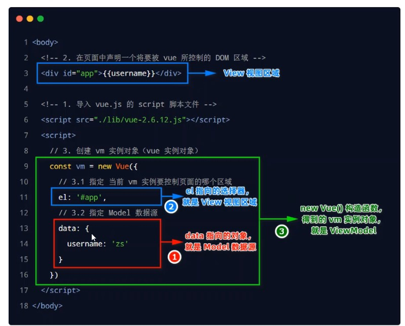

<h1>Vue学习笔记 Part02</h1>

<strong>目录</strong>
<a href="#title01">1. Vue 简介</a>
<a href="#title02">2. Vue 的基本使用</a>
<a href="#title03">3. Vue 的调试工具</a>
<a href="#title04">4. Vue 的指令与过滤器</a>
<a href="#title05">5. 品牌列表案例</a>

<!-- more -->

<style>
    .redFont {
        color: red;
    }
</style>

<h2 id="title01">1. Vue简介</h2>

<h3>1.1 什么是Vue</h3>

Vue 是一套<span class="redFont">用于构件用户界面的前端框架</span>

1. 构件用户界面
   - 用 vue 往 html 页面中填充数据，非常方便
2. 框架
   - 框架是一套现成的解决方案，程序员只能遵守框架的规范，去编写自己的业务功能
   - 要学习 vue，就是在学习 vue 框架中规定的用法
   - vue 的指令、组件（是对 UI 结构的复用）、路由、Vuex、vue 组件库
   - 掌握上列内容，才具备 vue 项目开发能力

<h3>1.2 Vue的特性</h3>

1. 数据驱动视图
   - 数据的变化会**驱动视图自动更新**
   - 好处：程序员只管把数据维护好，页面结构会被 vue 自动渲染出来
2. 双向数据绑定
   > 在网页中，form 表单负责**采集数据**，Ajax 负责**提交数据**
   - js 数据的变化，会被自动渲染到页面上
   - 页面上表单采集的数据发生变化的时候，会被 vue 自动获取到，并更新到 js 数据中

<h4>1.2.1 数据驱动试图</h4>

在使用了 vue 的页面中，vue 会<span class="redFont">监听数据的变化</span>，从而<span class="redFont">自动</span>重新渲染页面的结构。

- 好处：当页面数据发生变化时，页面会自动重新渲染
- 注意：数据驱动视图是<span class="redFont">单向的数据绑定</span>

<h4>1.2.2 双向数据绑定</h4>

在填写表单时，双向数据绑定可以辅助开发者在<span class="redFont">不操作 DOM 的前提下，自动</span>把用户填写的内容<span class="redFont">同步到</span>数据源中

- 好处：开发者不再需要手动操作 DOM 元素，来获取表单元素最新的值

> 注意：数据驱动视图和双向数据绑定的底层原理是 MVVM

<h4>1.2.3 MVVM</h4>

<span class="redFont">MVVM</span>是 vue 实现<span class="redFont">数据驱动视图</span>和<span class="redFont">双向数据绑定</span>的核心原理。MVVM 指的是：Model、View 和 ViewModel，它把每个 HTML 页面都拆分成了三个部分：

1. <span class="redFont">Model</span>表示当前页面渲染时所依赖的数据源
2. <span class="redFont">View</span>表示当前页面所渲染的 DOM 结构
3. <span class="redFont">ViewModel</span>表示 vue 的实例，是 MVVM 的核心

<span class="redFont">ViewModel 作为 MVVM 的核心</span>，是它把当前页面的<span class="redFont">数据源（Model）</span>和<span class="redFont">页面的结构（View）</span>连接到了一起

当<span class="redFont">数据源发生变化</span>时，会被 ViewModel 监听到，VM 会根据最新的数据源<span class="redFont">自动更新</span>页面的结构

当<span class="redFont">表单元素的值发生变化</span>时，也会被 VM 监听到，VM 会把变化过后最新的值<span class="redFont">自动同步</span>到 Model 数据源中

<h3>1.3 Vue的版本</h3>

当前，vue 共有 3 个大版本，其中：

- <span class="redFont">2.x 版本的 vue 是目前企业级项目开发中的主流版本</span>
- 3.x 版本的 vue 于 2020-09-19 发布，生态还不完善，-尚未在企业级项目开发中普及和推广
- 1.x 版本的 vue 几乎被淘汰，不再建议学习和使用

总结：

- <span class="redFont">3.x 版本的 vue 是未来企业级项目开发的趋势</span>
- 2.x 版本的 vue 在未来（1~2 年内）会被逐渐淘汰

<h2 id="title02">2. Vue的基本使用</h2>

<h3>2.1 基本使用步骤</h3>

1. 导入 vue.js 的 script 脚本文件
2. 在页面中声明一个将要被 vue 所控制的 DOM 区域
3. 创建 vm 实例对象（vue 实例对象）

```html
<body>
  <!-- 希望Vue能够控制下面的这个div，把数据填充到div内部 -->
  <div id="app">{{ username }}</div>

  <!-- 1. 导入Vue的库文件，在windows全局就有了Vue这个构造函数 -->
  <script src="lib/vue.js"></script>
  <!-- 2. 创建Vue的实例对象 -->
  <script>
    // 创建Vue的实例对象
    const vm = new Vue({
      // el属性是固定写法，表示当前vm实例要控制页面上的哪个区域，接收的值是一个选择器
      el: "#app",
      // data 对象就是要渲染到页面上的数据
      data: {
        username: "ZhangSan",
      },
    });
  </script>
</body>
```

<h3>2.2 基本代码与MVVM的对应关系</h3>



<h2 id="title03">3. Vue的调试工具</h2>

<h3>3.1 安装vue-devtools调试工具</h3>

vue 官方提供的 vue-devtools 调试工具，能够方便开发者对 vue 项目进行调试和开发。

<h3>3.2 配置Chrome浏览器中的vue-devtools</h3>

点击 Chrome 浏览器右上角的...按钮，选择：更多工具-扩展程序-Vue.js devtools 详细信息，然后勾选：有权访问的网址：在所有网站上、允许访问文件网址

<h2 id="title04">4. Vue的指令与过滤器</h2>

<h3>4.1 指令的概念</h3>

<span class="redFont">指令（Directives）</span>是 vue 为开发者提供的<span class="redFont">模板语法</span>，用于<span class="redFont">辅助开发者渲染页面的基本结构</span>

vue 中的指令<span class="redFont">按照不同的用途</span>可以分为如下 6 类：

1. 内容渲染指令
2. 属性绑定指令
3. 事件绑定指令
4. 双向绑定指令
5. 条件渲染指令
6. 列表渲染指令

注意：指令是 vue 开发中最基础、最常用、最简单的知识点

<h4>4.1.1 内容渲染指令</h4>

<span class="redFont">内容渲染指令</span>用来辅助开发者<span class="redFont">渲染 DOM 元素的文本内容</span>。常用的内容渲染指令有如下 3 个：

1. v-text

- 缺点：会覆盖元素内部原有的内容

2. {{}}插值表达式

- 在实际开发中用的最多，只是内容的占位符，不会覆盖原有的内容

3. v-html

- 可以把带有标签的字符串，渲染成 HTML 内容

<strong>v-text</strong>

- 注意：v-text 指令会<span class="redFont">覆盖元素内默认的值</span>

<strong>{{}}语法</strong>

vue 提供的<span class="redFont">{{}}</span>语法，专门用来解决 v-text 会覆盖默认文本内容的问题。这种{{}}语法的专业名称是<span class="redFont">插值表达式</span>（英文名：Mustache）

<strong>v-html</strong>

<span class="redFont">v-text</span>指令和<span class="redFont">插值表达式</span>只能渲染<span class="redFont">纯文本内容</span>。如果要把<span class="redFont">包含 HTML 标签的字符串</span>渲染为页面的 HTML 元素，则需要用的 v-html 指令

上述指令示例如下：

```html
<body>
  <!-- 希望Vue能够控制下面的这个div，把数据填充到div内部 -->
  <div id="app">
    <p v-text="username"></p>
    <p v-text="gender">性别</p>
    <hr />
    <p>姓名：{{username}}</p>
    <p>性别：{{gender}}</p>
    <hr />
    <div v-text="info"></div>
    <div>{{info}}</div>
    <div v-html="info"></div>
  </div>
  <!-- 1. 导入Vue的库文件，在windows全局就有了Vue这个构造函数 -->
  <script src="lib/vue.js"></script>
  <!-- 2. 创建Vue的实例对象 -->
  <script>
    // 创建Vue的实例对象
    const vm = new Vue({
      // el属性是固定写法，表示当前vm实例要控制页面上的哪个区域，接收的值是一个选择器
      el: "#app",
      // data 对象就是要渲染到页面上的数据
      data: {
        username: "ZhangSan",
        gender: "女",
        info: '<h4 style="color: red; font-weight: bold;">欢迎大家来学习vue.js</h4>',
      },
    });
  </script>
</body>
```

<h4>4.1.2 属性绑定指令</h4>

如果需要为<span class="redFont">元素的属性</span>动态绑定<span class="redFont">属性值</span>,则需要用到<span class="redFont">v-bind</span> 属性绑定指令。

> 注意:插值表达式只能用在元素的<strong>内容节点</strong>中,不能用在元素的**属性节点**中

- vue 规定：`v-bind:属性`指令可以简写为`:属性`
- 简写是英文的:
- 在使用 v-bind 属性绑定期间，如果绑定的内容需要进行动态拼接，则字符串的外面应该包裹单引号。例如：
  `<div :title="'box'+index">这是一个div</div>`

<strong>使用 JavaScript 表达式</strong>

在 vue 提供的模板渲染语法中，除了支持<span class="redFont">绑定简单的数据值</span>之外，还<span class="redFont">支持 Javascript 表达式的运算</span>

例如：

```html
{{ number + 1}} {{ok ? 'YES' : 'NO'}} {{message.split('').reverse().join('')}}
<div v-bind:id="'list-' + id"></div>
```

<h4>4.1.3 事件绑定指令</h4>

vue 提供了<span class="redFont">v-on 事件绑定</span>绑定指令，用来辅助程序员为 DOM 元素绑定事件监听。语法格式如下：

```html
<h3>count的值为 {{count}}</h3>
<!-- 语法格式为 v-on:事件名称="事件处理函数的名称" -->
<button v-on:click="addCount">+1</button>
```
